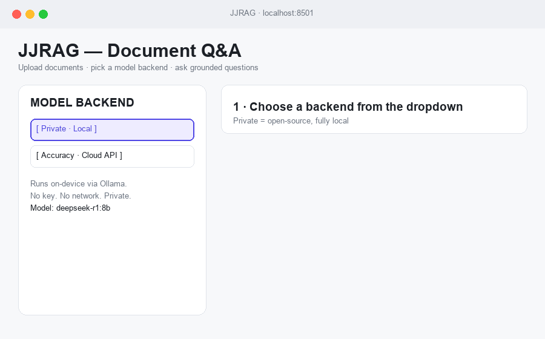

# 📄 JJRAG — Document Q&A with a switchable model backend

Upload your own documents and ask questions grounded in their contents. JJRAG
retrieves the relevant passages and generates an answer — and lets you choose,
from a single dropdown, **how** that answer is produced:

| Mode | Backend | Use it for |
| --- | --- | --- |
| 🔒 **Private (Local)** | Open-source models via **Ollama** + local embeddings | Maximum privacy — nothing leaves your machine, no API key needed |
| 🎯 **Accuracy (Cloud)** | The current best hosted model (**Claude Opus 4.8** by default; OpenAI optional) | Best answer quality — you supply your **own** API key |

Your API key is entered in the UI, held in session memory only, and is **never
written to disk, never logged, and never sent anywhere except the provider you
picked**. Document text is embedded **locally in both modes**, so your files are
never uploaded just to be indexed.

## Demo



## Features

- 📥 **Manually add documents** — drag in any number of PDF, DOCX, or TXT files.
- 🔀 **Switchable model** — pick Private vs. Accuracy from a dropdown; in
  Accuracy mode choose Anthropic (Claude) or OpenAI (GPT).
- 🔑 **Private API-key slot** — password-masked, session-only, never persisted.
- 🔒 **Local embeddings** (`all-MiniLM-L6-v2`) + **FAISS** vector search.
- 💬 **Grounded answers** with the exact source excerpts shown alongside.
- 🌊 **Streamed responses** for both local and cloud backends.

## Architecture

```
uploaded docs ─▶ load (PDF/DOCX/TXT) ─▶ chunk ─▶ LOCAL embeddings ─▶ FAISS
                                                                        │
                        question ─▶ similarity search (top-k) ──────────┘
                                            │
                    ┌───────────────────────┴────────────────────────┐
              🔒 Private                                        🎯 Accuracy
        Ollama (local LLM)                        Claude Opus 4.8 / OpenAI GPT
        no network, no key                        your key, in-memory only
```

The generation step is the piece added on top of the original retrieval-only
prototype (`JJrag_final.py`), which returned raw chunks without ever calling a
model. The chunk size was also fixed (40 → 1000 chars) so retrieval returns
coherent passages.

## Quick start

### 1. Install

```bash
git clone https://github.com/<your-user>/JJRAG.git
cd JJRAG
pip install -r requirements.txt
```

### 2. (Private mode) install a local model

```bash
# https://ollama.com — then pull any model you like:
ollama pull llama3          # or: ollama pull deepseek-r1:8b
```

### 3. Run

```bash
streamlit run rag_app.py
```

Open the URL Streamlit prints (default `http://localhost:8501`).

## Using the app

1. In the sidebar, choose **Private** or **Accuracy** from the dropdown.
   - **Accuracy** → pick a provider and paste your API key into the 🔑 slot.
   - **Private** → pick a locally installed Ollama model.
2. Drag documents into the uploader and click **Process documents**.
3. Type a question and click **Ask**. The answer streams in, with the source
   excerpts shown in the **Sources used** expander.

## Privacy & security

- 🔑 API keys live only in `st.session_state` for the browser session — not on
  disk, not in logs.
- 🔒 `.gitignore` excludes `.env`, `key.env`, `*.key`, logs, and caches so
  secrets can never be committed.
- 🖥️ Private mode makes **zero** outbound network calls — verify with a network
  monitor if you like.
- 📁 Embeddings run locally in both modes; only Accuracy mode's final
  generation call reaches a provider.

## Configuration

Copy `.env.example` to `.env` to override defaults (e.g. `OLLAMA_HOST`).
Environment-variable keys are optional — the in-app key box is the primary path.

## Original design notes

The initial design write-up and the original prototype (`JJrag.py`) are kept in
[`DESIGN_NOTES.md`](DESIGN_NOTES.md) and `JJrag.py`.
